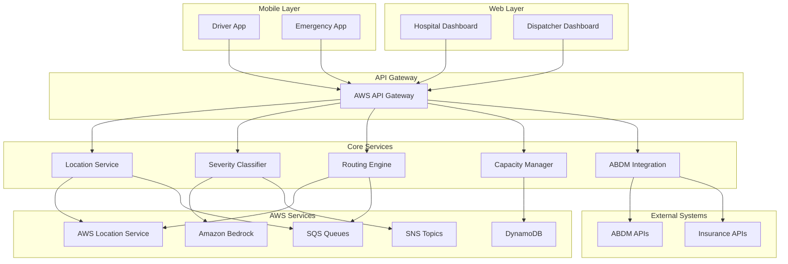

# Design Document: AI-Powered Ayushman Bharat Digital Mission Routing System

## Overview

The AI-powered Ayushman Bharat Digital Mission routing system for India is a cloud-native solution that leverages AWS services to optimize emergency medical response in Tier-2 cities. The system combines real-time location tracking, AI-powered patient severity analysis, and intelligent routing to reduce golden hour delays and improve patient outcomes.

The architecture follows a microservices pattern with event-driven communication, ensuring scalability and reliability for critical emergency operations. Key AWS services include Location Service for tracking, Bedrock for AI analysis, and integration with India's ABDM ecosystem for healthcare interoperability.

## Architecture

The system employs a distributed, event-driven architecture with the following key components:



### Service Communication

Services communicate through:
- **Synchronous**: REST APIs via API Gateway for real-time operations
- **Asynchronous**: SQS queues for location updates and routing calculations
- **Event Broadcasting**: SNS topics for severity alerts and capacity changes
- **Real-time Updates**: WebSocket connections for dashboard updates

## Components and Interfaces

### Location Tracking Service

**Purpose**: Manages real-time ambulance positioning using AWS Location Service

**Key Interfaces**:
```typescript
interface LocationTracker {
  updatePosition(ambulanceId: string, position: GeoPosition): Promise<void>
  getCurrentPosition(ambulanceId: string): Promise<GeoPosition>
  getLocationHistory(ambulanceId: string, timeRange: TimeRange): Promise<GeoPosition[]>
  subscribeToUpdates(ambulanceId: string, callback: LocationCallback): void
}

interface GeoPosition {
  latitude: number
  longitude: number
  accuracy: number
  timestamp: Date
  metadata?: Record<string, any>
}
```

**AWS Integration**: 
- Uses AWS Location Service Trackers for position storage
- Implements geofencing for hospital proximity alerts
- Provides 30-second update intervals with position filtering

### Severity Classification Service

**Purpose**: AI-powered patient condition analysis using Amazon Bedrock

**Key Interfaces**:
```typescript
interface SeverityClassifier {
  classifyPatient(symptoms: PatientSymptoms): Promise<SeverityResult>
  updateClassification(patientId: string, newData: PatientData): Promise<SeverityResult>
  getConfidenceScore(classification: SeverityLevel): number
}

interface PatientSymptoms {
  vitals: VitalSigns
  symptoms: string[]
  consciousness: ConsciousnessLevel
  painLevel: number
  medicalHistory?: string[]
}

interface SeverityResult {
  level: 'Critical' | 'High' | 'Medium' | 'Low'
  confidence: number
  recommendedSpecialty: string[]
  urgencyMinutes: number
}
```

**AI Model Configuration**:
- Uses Claude 3 Haiku for fast medical analysis
- Implements medical knowledge base via RAG
- Provides structured prompts for consistent classification
- Maintains audit trail for medical decisions

### Routing Engine Service

**Purpose**: Calculates optimal ambulance-to-hospital routes considering multiple factors

**Key Interfaces**:
```typescript
interface RoutingEngine {
  calculateOptimalRoute(request: RoutingRequest): Promise<RoutingResult>
  recalculateRoute(routeId: string, newConditions: TrafficConditions): Promise<RoutingResult>
  getAlternativeRoutes(routeId: string): Promise<RoutingResult[]>
}

interface RoutingRequest {
  ambulancePosition: GeoPosition
  patientSeverity: SeverityResult
  availableHospitals: Hospital[]
  trafficConditions: TrafficConditions
}

interface RoutingResult {
  hospitalId: string
  estimatedTime: number
  distance: number
  route: GeoPosition[]
  alternativeOptions: RouteOption[]
}
```

**Routing Algorithm**:
- Multi-criteria optimization: time, severity match, capacity
- Real-time traffic integration via AWS Location Service
- Dynamic re-routing based on hospital capacity changes
- Priority scoring: Critical patients get sub-15-minute routes

### Hospital Capacity Manager

**Purpose**: Real-time tracking of hospital resources and availability

**Key Interfaces**:
```typescript
interface CapacityManager {
  updateCapacity(hospitalId: string, capacity: HospitalCapacity): Promise<void>
  getAvailableHospitals(criteria: CapacityCriteria): Promise<Hospital[]>
  reserveBed(hospitalId: string, patientType: PatientType): Promise<ReservationResult>
  releaseReservation(reservationId: string): Promise<void>
}

interface HospitalCapacity {
  icuBeds: BedAvailability
  generalBeds: BedAvailability
  emergencyBeds: BedAvailability
  specialists: SpecialistAvailability[]
  equipment: EquipmentStatus[]
}

interface BedAvailability {
  total: number
  occupied: number
  reserved: number
  available: number
}
```

**Data Management**:
- DynamoDB for real-time capacity storage
- Automatic capacity alerts at 90% utilization
- Bed reservation system with timeout handling
- Integration with hospital management systems

### ABDM Integration Service

**Purpose**: Connects with India's Ayushman Bharat Digital Mission ecosystem

**Key Interfaces**:
```typescript
interface ABDMIntegration {
  retrieveHealthRecord(abhaId: string): Promise<HealthRecord>
  verifyInsurance(patientId: string, treatmentType: string): Promise<InsuranceStatus>
  shareEmergencyData(patientId: string, emergencyData: EmergencyRecord): Promise<void>
  getConsentStatus(patientId: string, dataType: string): Promise<ConsentStatus>
}

interface HealthRecord {
  abhaId: string
  demographics: PatientDemographics
  medicalHistory: MedicalRecord[]
  allergies: string[]
  medications: Medication[]
  insuranceDetails: InsuranceInfo[]
}
```

**ABDM Compliance**:
- Implements FHIR R4 standards for data exchange
- Handles consent management per ABDM protocols
- Supports offline operation when ABDM unavailable
- Maintains data privacy and security standards

## Data Models

### Core Entities

```typescript
// Ambulance Entity
interface Ambulance {
  id: string
  vehicleNumber: string
  currentPosition: GeoPosition
  status: 'Available' | 'Dispatched' | 'EnRoute' | 'AtHospital' | 'Offline'
  driverId: string
  equipment: MedicalEquipment[]
  lastUpdate: Date
}

// Emergency Call Entity
interface EmergencyCall {
  id: string
  callerId: string
  location: GeoPosition
  patientInfo: PatientInfo
  severity: SeverityResult
  assignedAmbulance?: string
  targetHospital?: string
  status: CallStatus
  timestamps: CallTimestamps
}

// Hospital Entity
interface Hospital {
  id: string
  name: string
  location: GeoPosition
  capacity: HospitalCapacity
  specialties: MedicalSpecialty[]
  contactInfo: ContactDetails
  abdmRegistered: boolean
  insuranceAccepted: string[]
}

// Patient Entity
interface Patient {
  id: string
  abhaId?: string
  demographics: PatientDemographics
  currentCondition: PatientSymptoms
  severity: SeverityResult
  insuranceInfo?: InsuranceInfo
  consentStatus: ConsentRecord[]
}
```

### Database Schema

**DynamoDB Tables**:

1. **Ambulances Table**
   - Partition Key: ambulanceId
   - GSI: status-index for available ambulance queries
   - TTL: position history cleanup after 24 hours

2. **Emergency Calls Table**
   - Partition Key: callId
   - GSI: status-timestamp-index for active call tracking
   - Stream: triggers routing calculations

3. **Hospitals Table**
   - Partition Key: hospitalId
   - GSI: location-index for proximity searches
   - Capacity updates trigger SNS notifications

4. **Patients Table**
   - Partition Key: patientId
   - GSI: abhaId-index for ABDM lookups
   - Encrypted sensitive medical data

**Data Relationships**:
- Emergency calls link to ambulances and hospitals
- Patients can have multiple emergency episodes
- Hospitals maintain capacity history for analytics
- Location data partitioned by time for efficient queries

## Correctness Properties

*A property is a characteristic or behavior that should hold true across all valid executions of a system—essentially, a formal statement about what the system should do. Properties serve as the bridge between human-readable specifications and machine-verifiable correctness guarantees.*

### Property 1: Location Tracking Consistency
*For any* active ambulance, position updates should occur every 30 seconds with accuracy within 50 meters, and 24-hour location history should be retrievable on demand.
**Validates: Requirements 1.1, 1.2, 1.4**

### Property 2: Offline Fallback Behavior  
*For any* ambulance with weak GPS signal or poor network connectivity, the system should use last known position with staleness indication and enable offline operation with cached data.
**Validates: Requirements 1.5, 9.3**

### Property 3: Alert Response Timing
*For any* ambulance going offline or system reaching 90% capacity, alerts should be generated within 60 seconds to appropriate personnel.
**Validates: Requirements 1.3, 3.5**

### Property 4: Severity Classification Performance
*For any* valid patient symptoms and vitals, the severity classifier should categorize as Critical/High/Medium/Low within 10 seconds with confidence above 85%.
**Validates: Requirements 2.1, 2.4**

### Property 5: Specialty-Based Routing
*For any* patient with critical severity or specific conditions (cardiac, trauma), routing should prioritize hospitals with appropriate specialists (ICU, cardiology) and facilities.
**Validates: Requirements 2.2, 2.3**

### Property 6: Input Validation and Error Handling
*For any* insufficient patient data or failed insurance verification, the system should request additional information or suggest alternatives while maintaining operation.
**Validates: Requirements 2.5, 8.3**

### Property 7: Real-Time Capacity Synchronization
*For any* hospital capacity update, changes should propagate to routing calculations within 30 seconds and automatically update ambulance assignments.
**Validates: Requirements 3.1, 3.2, 3.3**

### Property 8: Emergency Routing Performance
*For any* emergency call, the routing engine should calculate routes to top 3 suitable hospitals within 15 seconds, considering severity, capacity, specialists, and travel time.
**Validates: Requirements 4.1, 4.2**

### Property 9: Dynamic Route Optimization
*For any* traffic condition change or hospital unavailability, the system should recalculate routes and provide alternative options with driver notifications.
**Validates: Requirements 4.3, 4.4**

### Property 10: Critical Patient Time Prioritization
*For any* critical patient, routing should prioritize hospitals within 30-minute travel time over more distant facilities regardless of other factors.
**Validates: Requirements 4.5**

### Property 11: ABDM Integration Round-Trip
*For any* patient with ABDM ID, health record retrieval should complete within 45 seconds, and when consent is provided, emergency data should be shared back to ABDM network.
**Validates: Requirements 5.1, 5.3**

### Property 12: ABDM Fallback Operation
*For any* ABDM service unavailability, the system should continue operating with local patient data and insurance verification through alternative methods.
**Validates: Requirements 5.2, 5.5**

### Property 13: Driver App Navigation Consistency
*For any* driver assignment, the app should display pickup location with navigation, show real-time ETA updates, and notify hospitals of arrival status.
**Validates: Requirements 6.1, 6.2, 6.5**

### Property 14: Condition Update Propagation
*For any* patient condition change reported by drivers, severity updates should propagate through the system and trigger routing recalculation if necessary.
**Validates: Requirements 6.3**

### Property 15: Offline Navigation Capability
*For any* network disconnection, the driver app should maintain basic navigation functionality using cached map data.
**Validates: Requirements 6.4**

### Property 16: Hospital Dashboard Completeness
*For any* hospital dashboard view, it should display all required information: incoming ambulances with ETA and severity, current bed occupancy, specialist availability, and equipment status.
**Validates: Requirements 7.1, 7.2**

### Property 17: Real-Time Capacity Management
*For any* authorized hospital staff, capacity modifications should be reflected immediately in the dashboard and routing system.
**Validates: Requirements 7.3**

### Property 18: Conditional Patient Data Display
*For any* patient with ABDM data and consent, the hospital dashboard should display medical history and insurance status; otherwise, it should show available local data.
**Validates: Requirements 7.4, 7.5**

### Property 19: Automatic Insurance Processing
*For any* patient with insurance coverage, pre-authorization requests should initiate automatically, and emergency treatment should proceed with provisional approval during pending authorization.
**Validates: Requirements 8.1, 8.2**

### Property 20: Insurance Audit Trail Completeness
*For any* insurance transaction or government scheme verification, complete audit trails should be maintained with timestamps and user information.
**Validates: Requirements 8.4, 8.5**

### Property 21: Data Access Consent and Logging
*For any* patient data sharing request, explicit consent must be verified and all access attempts must be logged with user identification and timestamps.
**Validates: Requirements 10.3**

### Property 22: Security Breach Response
*For any* detected data breach or security incident, immediate alerts should be sent to administrators and affected parties within the required timeframe.
**Validates: Requirements 10.5**

## Error Handling

The system implements comprehensive error handling across all components:

### Location Service Errors
- **GPS Signal Loss**: Fallback to last known position with staleness indicators
- **AWS Location Service Outage**: Local caching with periodic retry attempts
- **Position Accuracy Issues**: Validation against reasonable movement patterns

### AI Classification Errors
- **Bedrock Service Unavailable**: Fallback to rule-based severity classification
- **Insufficient Patient Data**: Structured prompts for additional information collection
- **Low Confidence Scores**: Human review triggers and alternative classification methods

### Routing Engine Errors
- **No Available Hospitals**: Expand search radius and alert regional coordinators
- **Traffic Data Unavailable**: Use historical patterns and static route calculations
- **Hospital Capacity Changes**: Real-time recalculation with driver notifications

### ABDM Integration Errors
- **Network Connectivity Issues**: Local operation mode with sync when available
- **Authentication Failures**: Retry mechanisms with exponential backoff
- **Data Format Inconsistencies**: Validation and transformation layers

### Database and Infrastructure Errors
- **DynamoDB Throttling**: Exponential backoff with circuit breaker patterns
- **API Gateway Limits**: Request queuing and rate limiting
- **Service Mesh Failures**: Automatic failover to backup regions

## Testing Strategy

The system employs a comprehensive dual testing approach combining unit tests for specific scenarios and property-based tests for universal correctness validation.

### Property-Based Testing Configuration

**Framework**: Fast-check for TypeScript/JavaScript components
**Iterations**: Minimum 100 iterations per property test
**Test Environment**: AWS LocalStack for service mocking

Each property test is tagged with the format:
**Feature: ambulance-routing-system, Property {number}: {property_text}**

### Unit Testing Strategy

Unit tests focus on:
- **Specific Examples**: Known good/bad inputs and expected outputs
- **Edge Cases**: Boundary conditions and error scenarios  
- **Integration Points**: Service communication and data transformation
- **Error Conditions**: Failure modes and recovery mechanisms

### Test Coverage Areas

**Location Tracking Tests**:
- Position update frequency and accuracy validation
- Geofencing and proximity alert functionality
- Historical data retrieval and cleanup

**AI Classification Tests**:
- Medical symptom parsing and severity scoring
- Confidence threshold validation
- Fallback classification mechanisms

**Routing Algorithm Tests**:
- Multi-criteria optimization validation
- Real-time recalculation accuracy
- Alternative route generation

**ABDM Integration Tests**:
- Health record retrieval and consent management
- Data format compliance and transformation
- Offline operation and sync mechanisms

**Security and Compliance Tests**:
- Data encryption and access control validation
- Audit trail completeness and integrity
- Privacy compliance and consent verification

### Performance Testing

**Load Testing**: Simulate 1000 concurrent ambulance tracking requests
**Stress Testing**: Validate system behavior under resource constraints
**Latency Testing**: Verify response time requirements for critical operations
**Failover Testing**: Validate backup system activation and recovery times

The testing strategy ensures both functional correctness through property-based validation and operational reliability through comprehensive unit and integration testing.